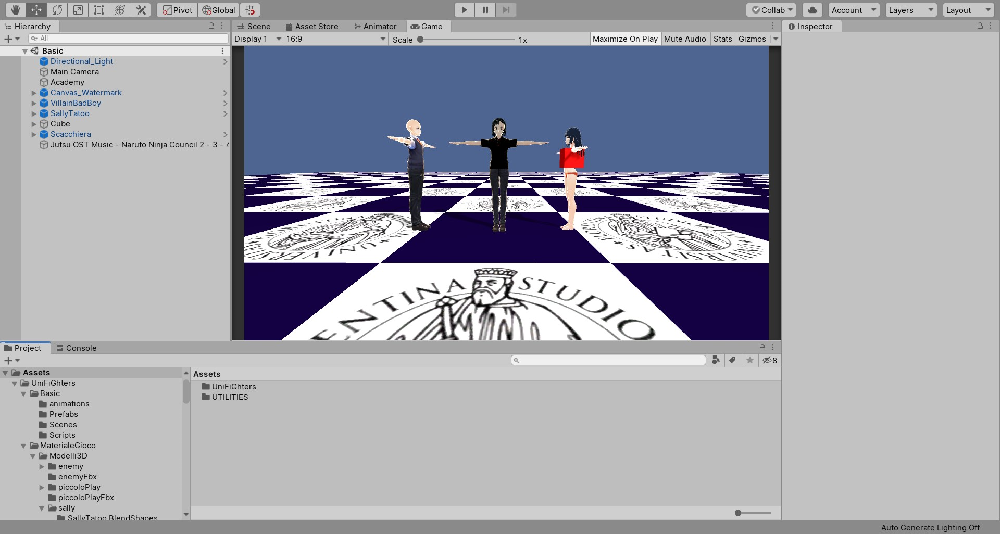

# Uni_Fi_ghters-Progetto-CG
Un piccolo ReadMe per muovervi all'interno del progetto.
Nella folder ProgettoUnty e' presente il progetto..
Importando il progetto su Unity vi troverete in una scena Basic.
Il compito di tale scena e prendere familiarita' con l'addestramento degli Agenti.

Come potete notare negli Assets sono presenti due Cartelle. 
Nella Folder UTILIETIS sono presenti diversi tutorial (che non ho eliminato perche' sono molto disordinato..) gli scripts di Ml-Agents
ed Nuitrack.

